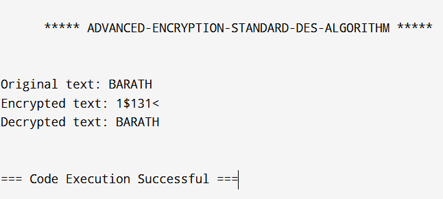

# EX-7-ADVANCED-ENCRYPTION-STANDARD-DES-ALGORITHM

## Aim:
  To use Advanced Encryption Standard (AES) Algorithm for a practical application like URL Encryption.

## ALGORITHM: 
  1. AES is based on a design principle known as a substitution–permutation. 
  2. AES does not use a Feistel network like DES, it uses variant of Rijndael. 
  3. It has a fixed block size of 128 bits, and a key size of 128, 192, or 256 bits. 
  4. AES operates on a 4 × 4 column-major order array of bytes, termed the state

## PROGRAM: 
```
#include <stdio.h>
#include <string.h>


  void xor_encrypt_decrypt(char *input, char *key) {
int input_len = strlen(input);
int key_len = strlen(key);

for (int i = 0; i < input_len; i++) {
    input[i] = input[i] ^ key[i % key_len];
}
}

int main() {
    printf("\n\n\n\n      ***** ADVANCED-ENCRYPTION-STANDARD-DES-ALGORITHM *****\n\n\n");
    
char url[] = "BARATH";
char key[] = "secretkey"; 

printf("Original text: %s\n", url);

xor_encrypt_decrypt(url, key);
printf("Encrypted text: %s\n", url);

xor_encrypt_decrypt(url, key);
printf("Decrypted text: %s\n", url);

return 0;
}
```
## OUTPUT:


## RESULT: 
The execution program is successfully executed.
